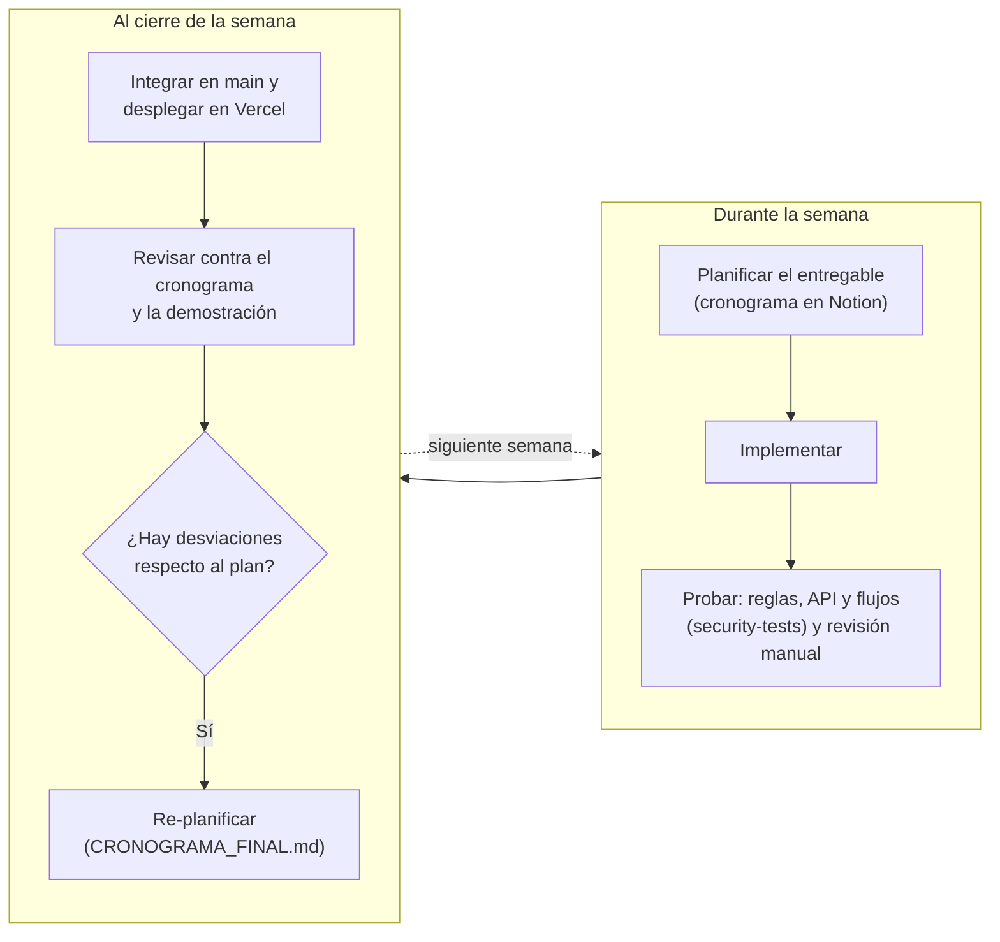
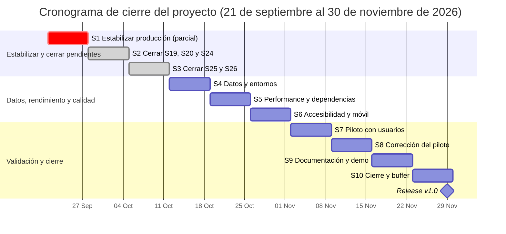
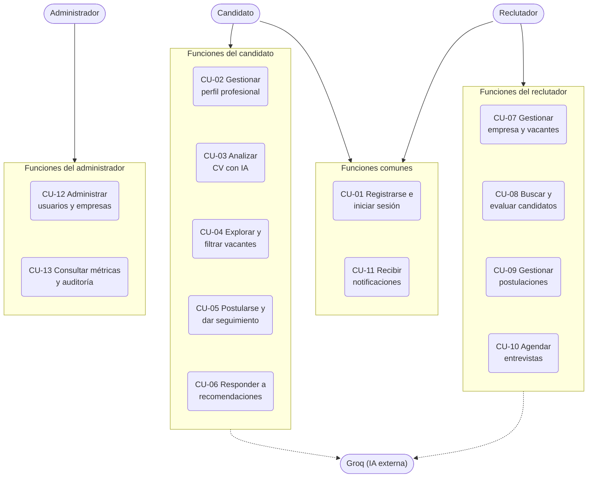
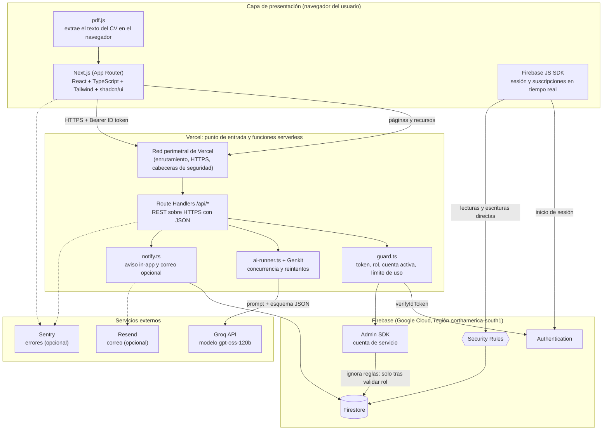
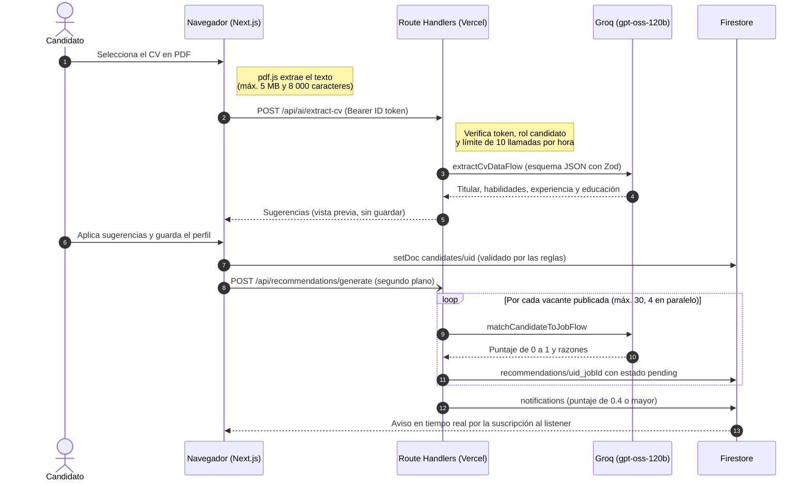
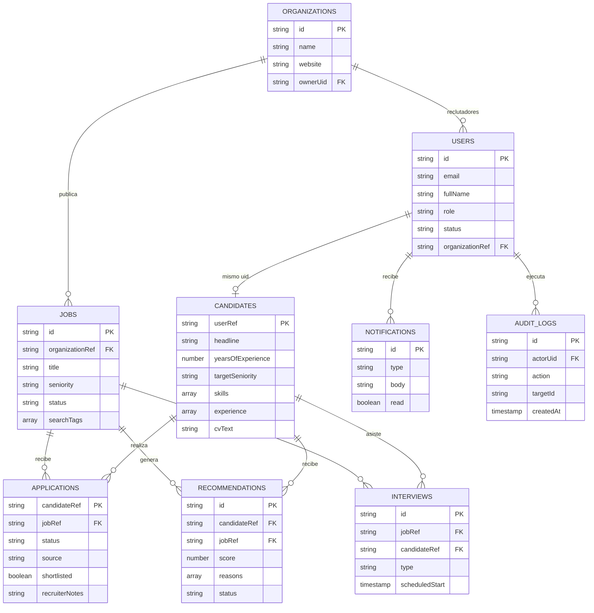
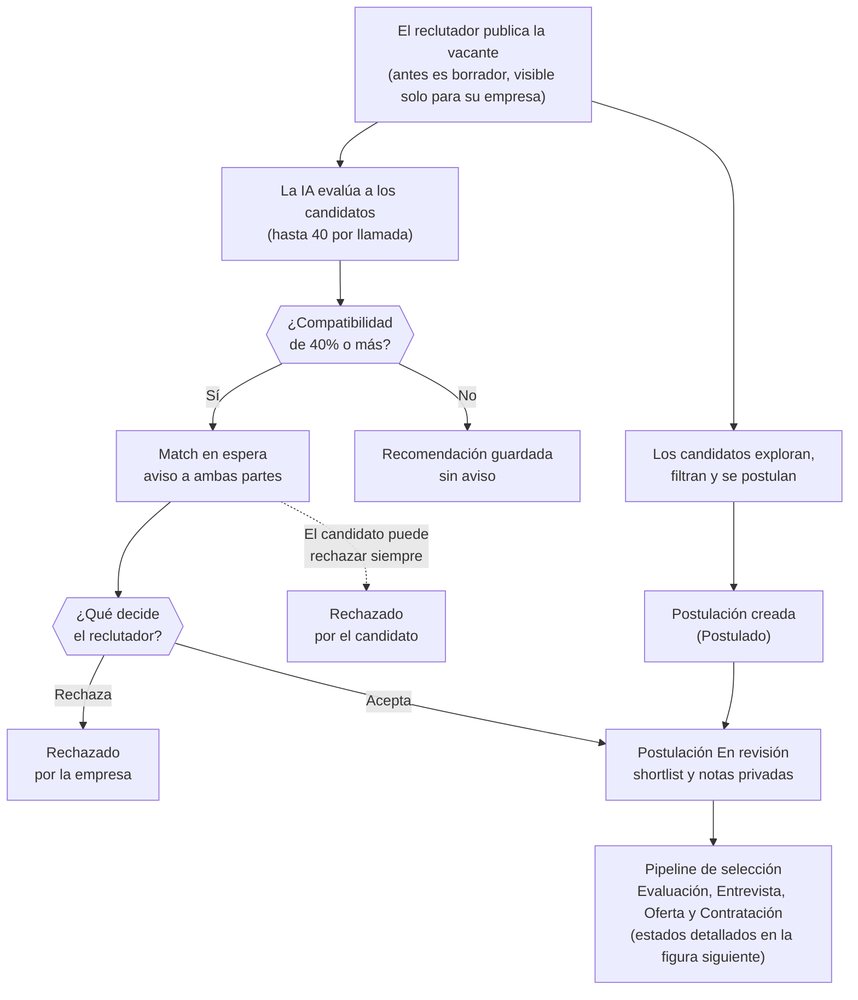
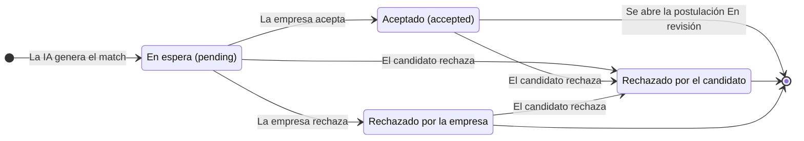
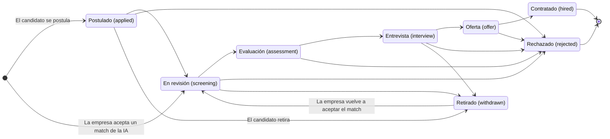
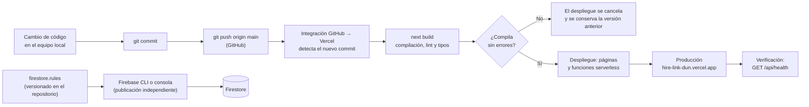

# Diagramas del capítulo 7 (código Mermaid)

Código fuente de los diagramas de la sección 7 de la documentación (*Metodología y Documentación de Construcción del Proyecto*). GitHub los renderiza directamente; para generar imágenes se puede usar `@mermaid-js/mermaid-cli` (`mmdc -i diagrama.mmd -o diagrama.png`) o pegarlos en https://mermaid.live.

## Figura 11. Ciclo de trabajo semanal

Capítulo 7.1.1 de la documentación.

## Figura 12. Cronograma de cierre (21 sep - 30 nov 2026)

Capítulo 7.1.3. Estado al 4 de octubre de 2026.

## Figura 13. Casos de uso

Capítulo 7.2.4. Los 13 casos agrupados por actor.

## Figura 14. Arquitectura del sistema

Capítulo 7.3.1.

## Figura 15. Secuencia: análisis de CV y cálculo de compatibilidad

Capítulo 7.3.3.

## Figura 16. Modelo entidad-relación lógico

Capítulo 7.4.1. Firestore es documental; las relaciones son referencias por id.

## Figura 17. Proceso de contratación

Capítulo 7.4.5.

## Figura 18. Estados del match generado por la IA

Capítulo 7.4.5.

## Figura 19. Estados de una postulación

Capítulo 7.4.5.

## Figura 20. Pipeline de despliegue

Capítulo 7.7.2.

